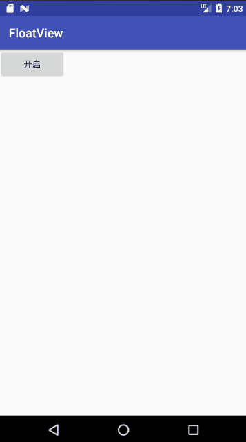

# FloatBallView

仿360实现了一个球形悬浮窗，拖动水波浪效果，可随意拖动，松开时自动靠边吸附。
双击可以打开一个底部栏，目前底部栏什么都没有加，只是一个样例。

## GIF

##使用方法

在需要打开的地方插入：

                FloatViewManager fm=FloatViewManager.getInstance(MainActivity.this);
                fm.showFloatBallView();

##注意事项：
使用`TYPE_TOAST`绕过4.4以上需要用户手动授予权限的操作，但是4.4以下会存在无法获取焦点这一问题，所以添加了权限判断，将在4.4以下使用`TYPE_PHONE`
并且还有一点，4.4以上使用`TYPE_TOAST`的浮窗，在横屏情况下无法禁止输入法全屏。